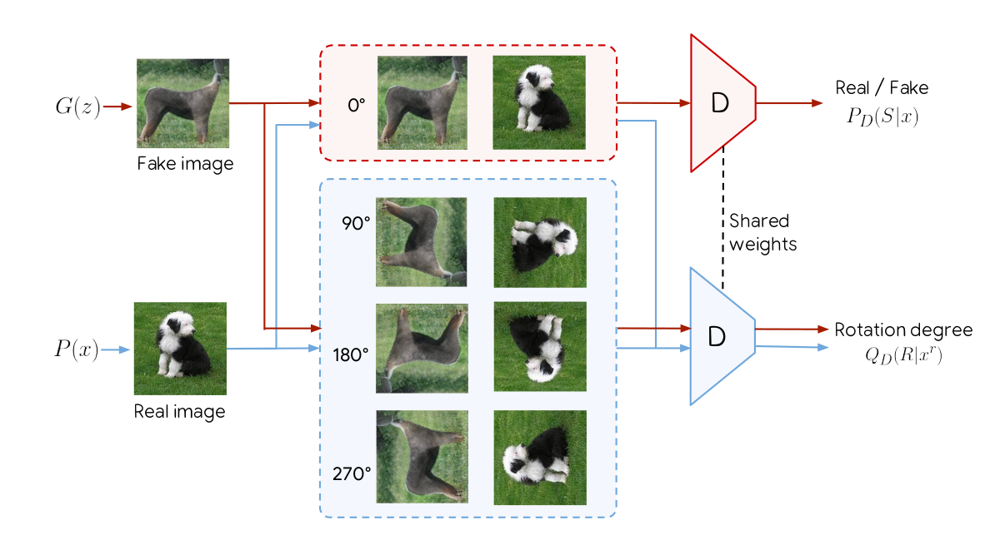
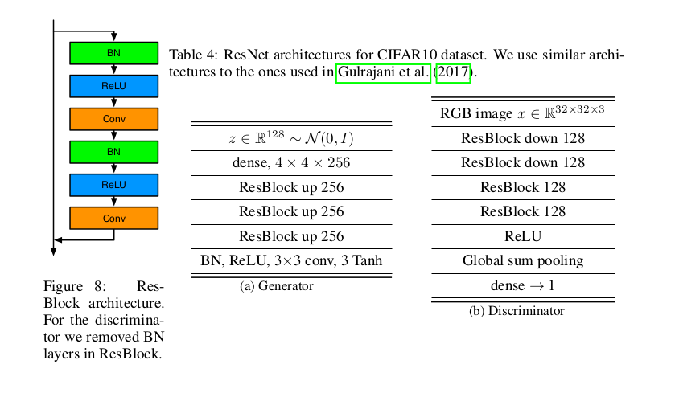
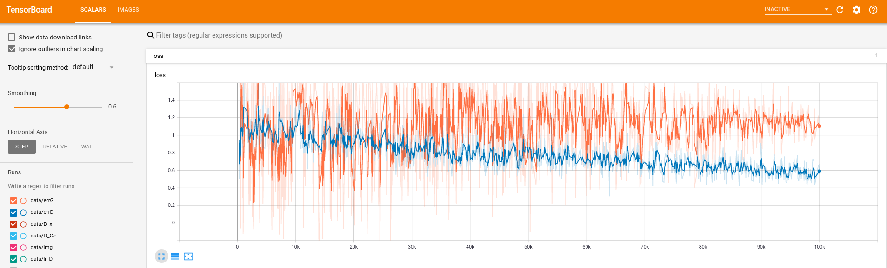
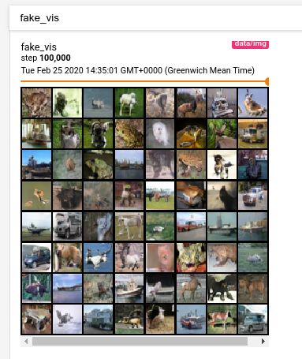
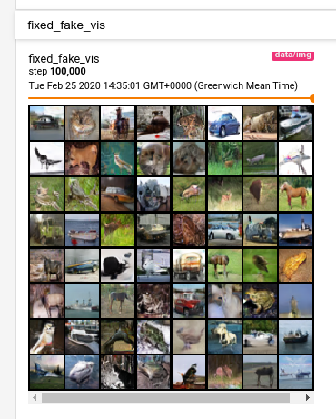

Tutorial
========

Introduction
------------

In this tutorial, we will learn how to implement a state-of-the-art GAN
with `Mimicry <https://github.com/kwotsin/mimicry>`__, a PyTorch library
for reproducible GAN research. As an example, we demonstrate the
implementation of the `Self-supervised GAN
(SSGAN) <https://arxiv.org/abs/1811.11212>`__ and train/evaluate it on
the CIFAR-10 dataset. SSGAN is of interest since at the time of this
writing, it is one of the state-of-the-art unconditional GANs for image
synthesis.

Self-supervised GAN
-------------------

  **Figure 1:** Overview of SSGAN. The original GAN task for the discriminator is kept the same, with the discriminator seeing only upright image to solve this task. However, the discriminator now has an additional task of classifying 1 of 4 rotations of incoming real/fake images.

The key idea of SSGAN lies in using one additional objective to
regularize GAN training, on top of having the conventional GAN training
objective. This additional objective is the self-supervised task of
having the discriminator predict one of four rotations of given
real/fake images.

Why is predicting rotations a self-supervised task? The idea is that
there are no explicit labels required from humans, and simply performing
a transformation on the data is sufficient to obtain a label (or
“pseudo-label”) that describes the data. For example, given an image, we
can rotate it by 0 degrees, call it class 0, or rotate it by 90 degrees
and call it class 1. We can do this for 4 different rotations, so that
the set of degrees of rotation
:math:`\mathcal{R} = \{0^\circ, 90^\circ, 180^\circ, 270^\circ\}`
gives classes :math:`0` to :math:`3` respectively (note the
zero-indexing). This is unlike in datasets like ImageNet, where humans
are required to explicitly label if an image represents a cat or a dog.
Here, our classes are arbitrarily designed, but individually correspond
to one of 4 rotations (e.g. class 3 would describe a 270 degrees rotated
image). Formally, we can represent the losses for the generator (G) and
discriminator (D) as such:

.. math:: \mathcal{L}_G = -V(G, D) - \alpha \mathbb{E}_{x\sim P_G} \mathbb{E}_{r \sim \mathcal{R}}[\log Q_D(R=r \vert x^r)]

.. math:: \mathcal{L}_D = V(G, D) - \beta \mathbb{E}_{x\sim P_{\text data}} \mathbb{E}_{r \sim \mathcal{R}}[\log Q_D(R=r \vert x^r)]

where V represents the GAN value function, :math:`P_G` represents the
generated image distribution, :math:`x^r` represents a rotated image,
and :math:`Q_D` represents the classification predictive distribution of
a given rotated image, which we can obtain using an additional
fully-connected (FC) layer.

Understanding the above 2 equations from the paper is *important*, since
it explicitly tells us that only the rotation loss from the fake images
is applied for the generator, and correspondingly, only the rotation
loss from real images is applied for the discriminator. Intuitively,
this makes sense since we do not want the discriminator to be penalised
for fake images that not look realistic, and the generator should strive
to produce images that look natural enough to be rotated in a way that
is easy for the auxiliary classifier to solve.

While this method of predicting rotations is simple, it has seen
excellent performance in representation learning (`Gidaris
2018 <https://arxiv.org/abs/1803.07728>`__). The insight from SSGAN is
that one could use this self-supervised objective to alleviate a key
problem in GANs: catastrophic forgetting of the discriminator. The paper
presents further insights into this, for which the reader is highly
encouraged to read.

However, to simplify the above expression into a form we can implement,
we can express for some optimal discriminator :math:`\hat{D}` and
optimal generator :math:`\hat {G}`.

.. math:: \mathcal{L}_G = \mathcal{L}_{\text{GAN}}(G, \hat{D}) + \alpha \mathcal{L}_{SS}

.. math:: \mathcal{L}_D = \mathcal{L}_{\text{GAN}}(\hat{G}, D) + \beta \mathcal{L}_{SS}

where :math:`\mathcal{L}_{\text{GAN}}` is simply the hinge loss for
GANs, and :math:`\mathcal{L}_{SS}` is the self-supervised loss for the
rotation, which we can implement as a standard cross entropy loss. In
Mimicry, the hinge loss is already implemented, so we only need to
implement the self-supervised loss. Here, :math:`\alpha` and
:math:`\beta` refer to the loss scales for the self-supervised loss.

Implementing Models
-------------------

  **Figure 2:** Residual backbone networks for generator and discriminator.

Firstly, we construct the models based on the residual network backbone
architectures, which have been frequently used in recent
state-of-the-art GANs. SSGAN similarly does this and follows the
architecture in `Miyato et al <https://arxiv.org/abs/1802.05957>`__,
where Spectral Normalization GAN (SNGAN) was introduced. which we
similarly adopt. Figure 2 illustrates this particular set of backbone
architectures. Specifically, we know from Figure 2 the
key variables are:

-  ``nz=128``: The initial noise vector dimension is 128.
-  ``ngf=256``: The generator feature map size is 256.
-  ``ndf=128``: The discriminator feature map size is 128.
-  ``bottom_width=4``: The initial spatial resolution for progressively
   increasing resolution at the generator is 4.

Having done so, we are only left to implement the specific ways to train
our GAN. We import several tools we’ll need later in advance:

::

   import torch
   import torch.nn as nn
   import torch.nn.functional as F
   import torch.optim as optim

   import numpy as np

   import torch_mimicry as mmc
   from torch_mimicry.nets import gan
   from torch_mimicry.modules import SNLinear
   from torch_mimicry.modules import GBlock, DBlock, DBlockOptimized

Discriminator
^^^^^^^^^^^^^

Now, we define an ``SSGANDiscriminator`` class that inherits from an
abstract base class ``BaseDiscriminator``, which is a basic definition
of an unconditional GAN discriminator in Mimicry. This class requires
the discriminator feature map size ``ndf`` and a ``loss_type`` argument,
which we can simply set it as the hinge loss.

::

   class SSGANDiscriminator(gan.BaseDiscriminator):
       def __init__(self, ndf=128, loss_type='hinge', **kwargs):
           super().__init__(ndf=ndf, loss_type=loss_type, **kwargs)

Now, we define some variables that we’ll need to use later. We know that
the number of rotations is 4, so we have 4 classes. For scaling the SS
loss, this is the :math:`\beta` variable in the paper which is set to
1.0.

::

   class SSGANDiscriminator(gan.BaseDiscriminator):
       def __init__(self, ndf=128, loss_type='hinge', **kwargs):
           super().__init__(ndf=ndf, loss_type=loss_type, **kwargs)
           self.num_classes = 4
           self.ss_loss_scale = 1.0

To define the layers, we can simply follow Figure 2 and use the residual
blocks. For the discriminator, we need to use ``DBlock`` and
``DBlockOptimized``. These residual blocks are similar, except that
``DBlockOptimized`` is the first residual block that is always used.
This naming convention and design follows closely to the original SNGAN
implementation. By default, we have spectral normalization enabled for
all residual blocks, although we can set ``spectral_norm=False`` to
disable it. Since SSGAN uses spectral normalization, we can safely
ignore this argument and follow Figure 2’s table for defining the
layers:

::

   class SSGANDiscriminator(gan.BaseDiscriminator):
       def __init__(self, ndf=128, loss_type='hinge', **kwargs):
           super().__init__(ndf=ndf, loss_type=loss_type, **kwargs)
           self.num_classes = 4
           self.ss_loss_scale = 1.0

           # Build layers
           self.block1 = DBlockOptimized(3, self.ndf)
           self.block2 = DBlock(self.ndf, self.ndf, downsample=True)
           self.block3 = DBlock(self.ndf, self.ndf, downsample=False)
           self.block4 = DBlock(self.ndf, self.ndf, downsample=False)
           self.l5 = SNLinear(self.ndf, 1)
           self.activation = nn.ReLU(True)

           nn.init.xavier_uniform_(self.l5.weight.data, 1.0)

However, we need to define an additional fully-connected layer for our
rotation classification, which in total gives the full model definition:

::

   class SSGANDiscriminator(gan.BaseDiscriminator):
       def __init__(self, ndf=128, loss_type='hinge', **kwargs):
           super().__init__(ndf=ndf, loss_type=loss_type, **kwargs)
           self.num_classes = 4
           self.ss_loss_scale = 1.0

           # Build layers
           self.block1 = DBlockOptimized(3, self.ndf)
           self.block2 = DBlock(self.ndf, self.ndf, downsample=True)
           self.block3 = DBlock(self.ndf, self.ndf, downsample=False)
           self.block4 = DBlock(self.ndf, self.ndf, downsample=False)
           self.l5 = SNLinear(self.ndf, 1)
           self.activation = nn.ReLU(True)

           nn.init.xavier_uniform_(self.l5.weight.data, 1.0)

           # Rotation class prediction layer
           self.l_y = SNLinear(self.ndf, self.num_classes)        
           nn.init.xavier_uniform_(self.l_y.weight.data, 1.0)

Following Figure 2, we can define the feedforward function of the paper
in a similar way as defining a regular PyTorch model, except that we now
need to output our rotation class logits:

::

       def forward(self, x):
           """
           Feedforwards a batch of real/fake images and produces a batch of GAN logits,
           and rotation classes.
           """
           h = x
           h = self.block1(h)
           h = self.block2(h)
           h = self.block3(h)
           h = self.block4(h)
           h = self.activation(h)

           # Global sum pooling
           h = torch.sum(h, dim=(2, 3))
           output = self.l5(h)

           # Produce the class output logits
           output_classes = self.l_y(h)

           return output, output_classes

Now, we need to define several functions to rotate our images. In SSGAN,
the image batch is split into 4 quarters, and each quarter is rotated
with a unique direction. For example, for a batch size of 64, the images
1-16 are 0 degrees rotated, images 17-32 are 90 degrees rotated, and so
on. We define a function that can easily rotate a given image:

::

   def _rot_tensor(self, image, deg):
       """
       Rotation for pytorch tensors using rotation matrix. Takes in a tensor of (C, H, W shape).
       """
       if deg == 90:
           return image.transpose(1, 2).flip(1)

       elif deg == 180:
           return image.flip(1).flip(2)

       elif deg == 270:
           return image.transpose(1, 2).flip(2)

       elif deg == 0:
           return image

       else:
           raise NotImplementedError(
               "Function only supports 90,180,270,0 degree rotation.")

To rotate an entire batch of images, we can define a function, which
rotates the image **and** gives us the corresponding rotated labels
back. These labels are our “pseudo-labels” that we have arbitrarily
created for the model.

::

   def _rotate_batch(self, images):
       """
       Rotate a quarter batch of images in each of 4 directions.
       """
       N, C, H, W = images.shape
       choices = [(i, i * 4 // N) for i in range(N)]

       # Collect rotated images and labels
       ret = []
       ret_labels = []
       degrees = [0, 90, 180, 270]
       for i in range(N):
           idx, rot_label = choices[i]

           # Rotate images
           image = self._rot_tensor(images[idx],
                                    deg=degrees[rot_label])  # (C, H, W) shape
           image = torch.unsqueeze(image, 0)  # (1, C, H, W) shape

           # Get labels accordingly
           label = torch.from_numpy(np.array(rot_label))  # Zero dimension
           label = torch.unsqueeze(label, 0)

           ret.append(image)
           ret_labels.append(label)

       # Concatenate images and labels to (N, C, H, W) and (N, ) shape respectively.
       ret = torch.cat(ret, dim=0)
       ret_labels = torch.cat(ret_labels, dim=0).to(ret.device)

       return ret, ret_labels

To compute the SS loss from a given batch of *upright* (non-rotated)
images, we can define the following function that rotates this batch of
image, obtain the classification logits for computing the SS loss, and
scaling the loss correspondingly:

::

   def compute_SS_loss(self, images, scale):
       """
       Function to compute SS loss.
       """
       # Rotate images and produce labels here.
       images_rot, class_labels = self.rotate_batch(
           images=images)

       # Compute SS loss
       _, output_classes = self.forward(images_rot)

       err_SS = F.cross_entropy(
           input=output_classes,
           target=class_labels)

       # Scale SS loss
       err_SS = scale * err_SS

       return err_SS

Finally, a crucial step is to define the ``train_step`` function to
analyze how these components can produce a training step for the
discriminator. We define the ``train_step`` function that requires 4 key
components:

-  ``real_batch``: The input batch of images and labels,
-  ``netG``: The input generator for generating fake images.
-  ``optD``: The optimizer for the discriminator update.
-  ``log_data``: A ``MetricLog`` object that we can use to collect our
   data in the pipeline.

where ``device`` and ``global_step`` are optional arguments which we can
ignore if we are not using them. Doing so, we can produce the GAN loss
in a way similar to training a DCGAN, where we first produce the logits.
For real images, this can be obtained from our ``real_batch`` argument,
but for fake images, we can simply call the in-built
``generate_images``.

::

   def train_step(self,
                  real_batch,
                  netG,
                  optD,
                  log_data,
                  device=None,               
                  global_step=None,
                  **kwargs):
       """
       Train step function for discriminator.
       """
       self.zero_grad()

       # Produce real images
       real_images, _ = real_batch
       batch_size = real_images.shape[0]  # Match batch sizes for last iter

       # Produce fake images
       fake_images = netG.generate_images(num_images=batch_size,
                                          device=device).detach()

       # Compute real and fake logits for gan loss
       output_real, _ = self.forward(real_images)
       output_fake, _ = self.forward(fake_images)

Now, we want to compute our losses, where we can use our functions
``compute_gan_loss`` (in-built from our base class), and the function we
defined ``compute_ss_loss``:

::

       # Compute GAN loss, upright images only.
       errD = self.compute_gan_loss(output_real=output_real,
                                    output_fake=output_fake)

       # Compute SS loss, rotates the images. -- only for real images!
       errD_SS = self.compute_ss_loss(images=real_images,
                                      scale=self.ss_loss_scale)

       # Backprop and update gradients
       errD_total = errD + errD_SS
       errD_total.backward()
       optD.step()

We can produce extra metrics for logging our progress, such as the
probabilities of the discriminator thinking a real/fake image is real.
We can add these information with ``log_data`` using its ``add_metric``
function, giving it a name and ``group`` to belong to. Here, ``group``
is optional but allows you to group together losses such as ``errD`` and
``errG`` to be on the same diagram in TensorBoard.

::

       # Compute probabilities
       D_x, D_Gz = self.compute_probs(output_real=output_real,
                                      output_fake=output_fake)

       # Log statistics for D
       log_data.add_metric('errD', errD, group='loss')
       log_data.add_metric('errD_SS', errD_SS, group='loss_SS')
       log_data.add_metric('D(x)', D_x, group='prob')
       log_data.add_metric('D(G(z))', D_Gz, group='prob')

       return log_data

Our final train step function for the discriminator looks is this
function returning ``log_data`` as before, since ``log_data`` acts like
a “message” that is being passed down the training pipeline to collect
more information:

::

   def train_step(self,
                  real_batch,
                  netG,
                  optD,
                  log_data,
                  device=None,                   
                  global_step=None,
                  **kwargs):
       """
       Train step function for discriminator.
       """
       self.zero_grad()

       # Produce real images
       real_images, _ = real_batch
       batch_size = real_images.shape[0]  # Match batch sizes for last iter

       # Produce fake images
       fake_images = netG.generate_images(num_images=batch_size,
                                          device=device).detach()

       # Compute real and fake logits for gan loss
       output_real, _ = self.forward(real_images)
       output_fake, _ = self.forward(fake_images)

       # Compute GAN loss, upright images only.
       errD = self.compute_gan_loss(output_real=output_real,
                                    output_fake=output_fake)

       # Compute SS loss, rotates the images. -- only for real images!
       errD_SS = self.compute_ss_loss(images=real_images,
                                      scale=self.ss_loss_scale)

       # Backprop and update gradients
       errD_total = errD + errD_SS
       errD_total.backward()
       optD.step()

       # Compute probabilities
       D_x, D_Gz = self.compute_probs(output_real=output_real,
                                      output_fake=output_fake)

       # Log statistics for D once out of loop
       log_data.add_metric('errD', errD, group='loss')
       log_data.add_metric('errD_SS', errD_SS, group='loss_SS')
       log_data.add_metric('D(x)', D_x, group='prob')
       log_data.add_metric('D(G(z))', D_Gz, group='prob')

       return log_data

Generator
^^^^^^^^^

Constructing the generator is a lot simpler, as the structure is similar
to SNGAN’s generator except that we now need to consider an additional
train step function. Similar to previously, let’s define the generator
object by inheriting from the ``BaseGenerator`` abstract class and
building the layers according to Figure 2:

::

   class SSGANGenerator(gan.BaseGenerator):
       def __init__(self,
                    nz=128,
                    ngf=256,
                    bottom_width=4,
                    loss_type='hinge',
                    **kwargs):
           super().__init__(nz=nz,
                            ngf=ngf,
                            bottom_width=bottom_width,
                            loss_type=loss_type,
                            **kwargs)
           self.ss_loss_scale = 0.2

           # Build the layers
           self.l1 = nn.Linear(self.nz, (self.bottom_width**2) * self.ngf)
           self.block2 = GBlock(self.ngf, self.ngf, upsample=True)
           self.block3 = GBlock(self.ngf, self.ngf, upsample=True)
           self.block4 = GBlock(self.ngf, self.ngf, upsample=True)
           self.b5 = nn.BatchNorm2d(self.ngf)
           self.c5 = nn.Conv2d(ngf, 3, 3, 1, padding=1)
           self.activation = nn.ReLU(True)

           # Initialise the weights
           nn.init.xavier_uniform_(self.l1.weight.data, 1.0)
           nn.init.xavier_uniform_(self.c5.weight.data, 1.0)

Here, we note that ``ss_loss_scale`` corresponds to the :math:`\alpha`
parameter in the paper, which is set to 0.2 for all datasets.

The feedforward function is simply passing some input noise through all
these layers, following Figure 2 to use ``tanh`` for the activation.
This is important since the output images will have values in the range
[-1, 1], which is the range we would normalize our images to:

::

   def forward(self, x):
       """
       Feedforward function.
       """
       h = self.l1(x)
       h = h.view(x.shape[0], -1, self.bottom_width, self.bottom_width)
       h = self.block2(h)
       h = self.block3(h)
       h = self.block4(h)
       h = self.b5(h)
       h = self.activation(h)
       h = torch.tanh(self.c5(h))

       return h

For the ``train_step`` function, we similarly take in 4 key arguments:

-  ``real_batch``: The input batch of images and labels,
-  ``netD``: The input discriminator for getting logits *(in contrast to
   defining netG)*.
-  ``optG``: The optimizer for the generator update *(in contrast to
   defining optD)*.
-  ``log_data``: A ``MetricLog`` object that we can use to log our data
   to tensorboard/printing.

We can similarly produce our GAN and SS losses like previously, and
update them.

::

   def train_step(self,
                  real_batch,
                  netD,
                  optG,
                  log_data,
                  device=None,
                  global_step=None,
                  **kwargs):
       """
       Train step function.
       """
       self.zero_grad()

       # Get only batch size from real batch
       batch_size = real_batch[0].shape[0]

       # Produce fake images and logits
       fake_images = self.generate_images(num_images=batch_size,
                                          device=device)
       output, _ = netD(fake_images)

       # Compute GAN loss, upright images only.
       errG = self.compute_gan_loss(output)

       # Compute SS loss, rotates the images -- fake images only!
       errG_SS = netD.compute_ss_loss(images=fake_images,
                                      scale=self.ss_loss_scale)

       # Backprop and update gradients
       errG_total = errG + errG_SS
       errG_total.backward()
       optG.step()

Now we can use ``add_metric`` again, but we want to group our metric to
be in the same group as ``errD`` and ``errD_SS``, so we can visualize
them more nicely in TensorBoard. This is optional, but would be
something nice to do.

::

   # Log statistics
   log_data.add_metric('errG', errG, group='loss')
   log_data.add_metric('errG_SS', errG_SS, group='loss_SS')

We return a ``log_data`` object like before, and have our final
train_step function looking like:

::

   def train_step(self,
                  real_batch,
                  netD,
                  optG,
                  log_data,
                  device=None,
                  global_step=None,
                  **kwargs):
       """
       Train step function.
       """
       self.zero_grad()

       # Get only batch size from real batch
       batch_size = real_batch[0].shape[0]

       # Produce fake images and logits
       fake_images = self.generate_images(num_images=batch_size,
                                          device=device)
       output, _ = netD(fake_images)

       # Compute GAN loss, upright images only.
       errG = self.compute_gan_loss(output)

       # Compute SS loss, rotates the images. -- fake images only!
       errG_SS = netD.compute_ss_loss(images=fake_images,
                                      scale=self.ss_loss_scale)

       # Backprop and update gradients
       errG_total = errG + errG_SS
       errG_total.backward()
       optG.step()

       # Log statistics
       log_data.add_metric('errG', errG, group='loss')
       log_data.add_metric('errG_SS', errG_SS, group='loss_SS')

       return log_data

Training
--------

Once the two models are constructed, training the GAN is as
straightforward. we can define the basic parts of our training pipeline:
our dataloader, models, and optimizers. We use the Adam optimizer, and
note that the beta parameters are chosen to be
:math:`(\beta_1, \beta_2) = (0.0, 0.9)` following the paper, which
traditionally have worked well for GAN training. To construct the
components of the pipeline:

::

   # Directories
   dataset_dir = './datasets'
   log_dir = './log/ssgan'

   # Data handling objects
   dataset = mmc.datasets.load_dataset(root='./datasets', name='cifar10')
   dataloader = torch.utils.data.DataLoader(
       dataset, batch_size=64, shuffle=True, num_workers=4)

   # Define models and optimizers
   device = torch.device('cuda:0' if torch.cuda.is_available() else "cpu")
   netG = SSGANGenerator().to(device)
   netD = SSGANDiscriminator().to(device)
   optD = optim.Adam(netD.parameters(), 2e-4, betas=(0.0, 0.9))
   optG = optim.Adam(netG.parameters(), 2e-4, betas=(0.0, 0.9))

Having these components done, we can simply build a ``Trainer`` object
to build the pipeline and start training!

::

   # Start training
   trainer = mmc.training.Trainer(
       netD=netD,
       netG=netG,
       optD=optD,
       optG=optG,
       n_dis=2,
       num_steps=100000,
       dataloader=dataloader,
       log_dir=log_dir)

   trainer.train()

Here, we note that ``n_dis`` is the number of discriminator update steps
per generator update step, which is set to 2 in the paper. The paper
further notes that SSGAN is trained for 100K generator steps, which we
follow.

Doing so, we can see the following outputs during training:

::

   INFO: [Epoch 1/127][Global Step: 2/100000] 
   | D(G(z)): 0.9987
   | D(x): 0.9992
   | errD: 7.7222
   | errD_SS: 3.6375
   | errG: 2.0727
   | errG_SS: 0.9488
   | lr_D: 0.0002
   | lr_G: 0.0002
   | (0.4046 sec/idx)
   ^CINFO: Saving checkpoints from keyboard interrupt...
   INFO: Training Ended.

and one can dynamically stop at any part of the training if required.

  **Figure 3:** Tensorboard visualizations of smoothened GAN losses.

After 100K training steps, we can visualise our training from
Tensorboard with ``tensorboard --logdir=./log/ssgan``, which produces
curves as seen in Figure 3.

Internally, a ``Logger`` object that is defined within ``Trainer`` would
also visualise images randomly generated every 500 steps, and also
images generated from a *fixed set of noise vectors*. This has 2
benefits: random images allows us to check the diversity of images
continuously, in case there is mode collapse, and *fixed* random images
where we can assess the quality of the images generated continuously.
Figures 4 and 5 give some examples.

  **Figure 4:** Randomly generated images in TensorBoard for checking diversity.

  **Figure 5:** Tensorboard visualisation of randomly generated images from a set of fixed noise vectors, to assess quality of images over training.

However it might be hard to understand the benefit of the second without
a concrete example. Fortunately, the ``Logger`` object also saves the
fixed fake images as ``png`` files every 500 steps (configurable), which
we can then use to generate a gif! We see this result in Figure 6 –
could you observe the gradual formation of certain classes like horses
and cars?

.. figure:: images/output.gif
  :width: 400
  :alt: Images generated over training iterations.

  **Figure 6:** GIF output from images generated from a set of fixed noise vector, as saved every 500 steps from the start of training till the end.

Evaluation
----------

When assessing GANs, it is difficult to simply judge how good a GAN is
through only a qualitative assessment of images. Several quantitative
metrics have been proposed, and one of which is the `Fréchet Inception
Distance (FID) <https://arxiv.org/abs/1706.08500>`__, which is also used
in the SSGAN paper. Generally, FID measures the Wasserstein-2 distance
between the Inception features, by assuming their distributions take the
form of a multivariate Gaussian. These inception features are obtained
through using an ImageNet pre-trained Inception model, which is
traditionally the one from TensorFlow, as used by the original authors
of FID, and similarly by authors of other metrics like `Inception Score
(IS) <https://arxiv.org/abs/1606.03498>`__ and `Kernel Inception
Distance(KID) <https://arxiv.org/abs/1801.01401>`__.

Naturally, changing the pre-trained inception model would cause some
differences in the output inception features. Thus, to ensure
**backwards compatibility** of the computed scores, Mimicry adopts the
**original TensorFlow implementations** of all metrics from the authors,
without exposing the TensorFlow backend to users.

Doing so, we can simply perform evaluate our FID using

::

   mmc.metrics.evaluate(
       metric='fid',
       log_dir=log_dir,
       netG=netG,
       dataset='cifar10',
       num_real_samples=10000,
       num_fake_samples=10000,
       evaluate_step=100000,
       device=device)

By default, we will run 3 times for computing FID, and report the mean
and standard deviation of the scores towards the end:

::

   INFO: Loading existing statistics for real images...
   INFO: Generated image 1000/10000 [Random Seed 0] (0.0011 sec/idx)
   INFO: Generated image 2000/10000 [Random Seed 0] (0.0009 sec/idx)
   INFO: Generated image 3000/10000 [Random Seed 0] (0.0009 sec/idx)
   INFO: Generated image 4000/10000 [Random Seed 0] (0.0009 sec/idx)
   INFO: Generated image 5000/10000 [Random Seed 0] (0.0009 sec/idx)
   INFO: Generated image 6000/10000 [Random Seed 0] (0.0009 sec/idx)
   INFO: Generated image 7000/10000 [Random Seed 0] (0.0009 sec/idx)
   INFO: Generated image 8000/10000 [Random Seed 0] (0.0009 sec/idx)
   INFO: Generated image 9000/10000 [Random Seed 0] (0.0009 sec/idx)
   INFO: Generated image 10000/10000 [Random Seed 0] (0.0009 sec/idx)
   INFO: Computing statistics for fake images...
   INFO: Propagated batch 200/200 (0.2466 sec/batch)
   INFO: FID (step 100000) [seed 0]: 17.950461181932667
   INFO: Computing FID in memory...
   ...
   ...
   INFO: Generated image 8000/10000 [Random Seed 1] (0.0009 sec/idx)
   INFO: Generated image 9000/10000 [Random Seed 1] (0.0009 sec/idx)
   INFO: Generated image 10000/10000 [Random Seed 1] (0.0009 sec/idx)
   ...
   ...
   INFO: FID (step 100000) [seed 1]: 17.46868878132358
   ...
   ...
   INFO: FID (step 100000) [seed 2]: 17.883670445065718
   INFO: FID (step 100000): 17.767606802773987 (± 0.2131184933218733) 
   INFO: FID Evaluation completed!

where we can cache our existing real image statistics to avoid hefty
recomputation, and also compare the generator’s performance with the
same set of real image statistics as it trains. We cache our result as a
JSON file in the log directory, so we can avoid re-computing the scores
at the same global step.

How well did we perform? From the paper, for the exact training
hyperparameters, the FID is reported to be **17.88 ± 0.64**, whereas we
achieved **17.77 ± 0.21** so our result is very close!

Final Code
----------

The overall code required to build this customised GAN can be found
`here <https://github.com/kwotsin/mimicry/blob/master/examples/ssgan_tutorial.py>`__.
While we have built the models from scratch as seen above, SSGAN is
currently one of the standard implementations available in Mimicry,
where you can import ``mmc.nets.ssgan.SSGANGenerator32`` and
``mmc.nets.ssgan.SSGANDiscriminator32`` directly.

Conclusion
----------

Mimicry allows researchers to focus a lot more on the GAN
implementation, which as you have experienced, takes up bulk of the
work! This reduces the need to re-implement boilerplate code for
training and evaluation, so one can focus on the research. For a list of
GANs we support, see
`Reproducibility <https://github.com/kwotsin/mimicry#reproducibility>`__.
For a list of over 70 baseline scores (at the time of this writing), see
`Baselines <https://github.com/kwotsin/mimicry#baselines>`__.

Feel free to contact me if you’d like to find out more about the work!
